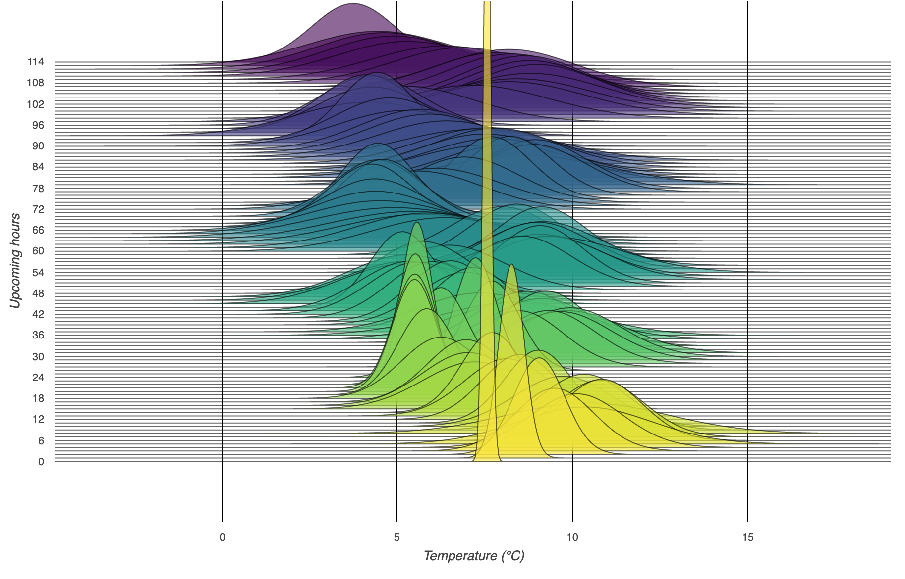

## Additions to timely-beliefs

## Generating new forecasts

Using the `generate.py` function, new forecasts can be generated using a BeliefsDataFrame.  
csv files containing timely beliefs or observations can be converted to a BeliefsDataFrame using the `csv_as_belief` function.

      >>> csv_file = 'energy_data.csv'
      >>> df = csv_as_belief(csv_file,-9,None)
 
The function takes a `belief_time`, an `event_start` and an optional `event_end`. When the event_end is omitted a single forecast will be generated instead of a forecast period.

      >>> belief_time = datetime.datetime(2015, 1, 1, 16,15, tzinfo=pytz.utc)
      >>> event_start = datetime.datetime(2019, 6, 30, 13,0, tzinfo=pytz.utc)
      >>> event_end = datetime.datetime(2019, 6, 30, 15,15, tzinfo=pytz.utc)
      >>> new_df = main(df, belief_time, event_start, event_end)
      >>> print(new_df)
                                                                                          event_value
      event_start               belief_time               source cumulative_probability             
      2019-06-30 13:00:00+00:00 2015-01-01 16:15:00+00:00 test1  0.5                          12.975
      2019-06-30 13:15:00+00:00 2015-01-01 16:15:00+00:00 test2  0.5                          12.975
      2019-06-30 13:30:00+00:00 2015-01-01 16:15:00+00:00 test3  0.5                          12.975
      2019-06-30 13:45:00+00:00 2015-01-01 16:15:00+00:00 test4  0.5                          12.975
      2019-06-30 14:00:00+00:00 2015-01-01 16:15:00+00:00 test5  0.5                          12.975
      2019-06-30 14:15:00+00:00 2015-01-01 16:15:00+00:00 test6  0.5                          12.975
      2019-06-30 14:30:00+00:00 2015-01-01 16:15:00+00:00 test7  0.5                          12.975
      2019-06-30 14:45:00+00:00 2015-01-01 16:15:00+00:00 test8  0.5                          12.975
      2019-06-30 15:00:00+00:00 2015-01-01 16:15:00+00:00 test9  0.5                          12.975
      2019-06-30 15:15:00+00:00 2015-01-01 16:15:00+00:00 test10 0.5                          12.975

### Ridgeline plot

Create ridgeline plot showing how the confidence of fluctuating temperature forecasts deteriorates as we look further into the future, or as we look at the beliefs approaching an event.
An example of the former can be seen below, this can be created by;

    >>> df = make_df()
    >>> ridgeline_plot(datetime.datetime(2015, 3, 1, 9, 0, tzinfo=pytz.utc), df, fixedviewpoint=True)

The latter can be created using;

    >>> df = make_df()
    >>> ridgeline_plot(datetime.datetime(2015, 3, 1, 9, 0, tzinfo=pytz.utc), df, end=150, fixedviewpoint=False)
    

